# Введение

Для начала хочу сказать спасибо за это тестовое - поначалу было очень тяжело,
но в итоге я очень сильно прокачался по хардам в этом стеке, и вообще в вебе в целом.
## Стек
- Golang 1.22
- PostgreSQL
- Redis
- Docker

А теперь к сути

# Требования по утилитам

- Утилита GNU Make
- Docker

Желательно ещё Postman, чтобы легче тестировать, но можно обойтись без него, я ниже
привел [примеры](#примеры-запросов-и-ответов-много-картинок-из-postman)

# Инструкция по запуску

Чтобы запустить сервис, достаточно написать в корневой папке репозитория

```
make first-run
```

Эта команда соберет docker image со всеми зависимостями, запустит контейнеры и проведет тесты.
<details>
<summary>Ньюансы первого запуска</summary>
При первом старте контейнеры после запуска перезапустятся - это нормально.
Это нужно, чтобы база в Postgres создалась и к ней можно было подключиться
</details>
Во время тестов будет создано 200 случайных банеров

> Если у вас не прошёл какой-то тест, скорее всего вам просто не повезло.
> При генерации баннеров используются случайные значения uint32. Попробуйте запустить тесты ещё раз
> с помощью```make test```

Если нужно сгенерировать больше банеров, используйте

```
make fake_banners
```

Если нужно перезапустить:

```
make restart
```

Все команды можно найти в Makefile

# Примеры запросов и ответов (много картинок из Postman)

Можете импортировать в Postman эту [collection](assets/(banner)Avito%20trainee%20assignment.postman_collection.json)
и тестировать самостоятельно

При автоматическом тестировании было создано 200 случайных баннеров, давайте их получим<br>
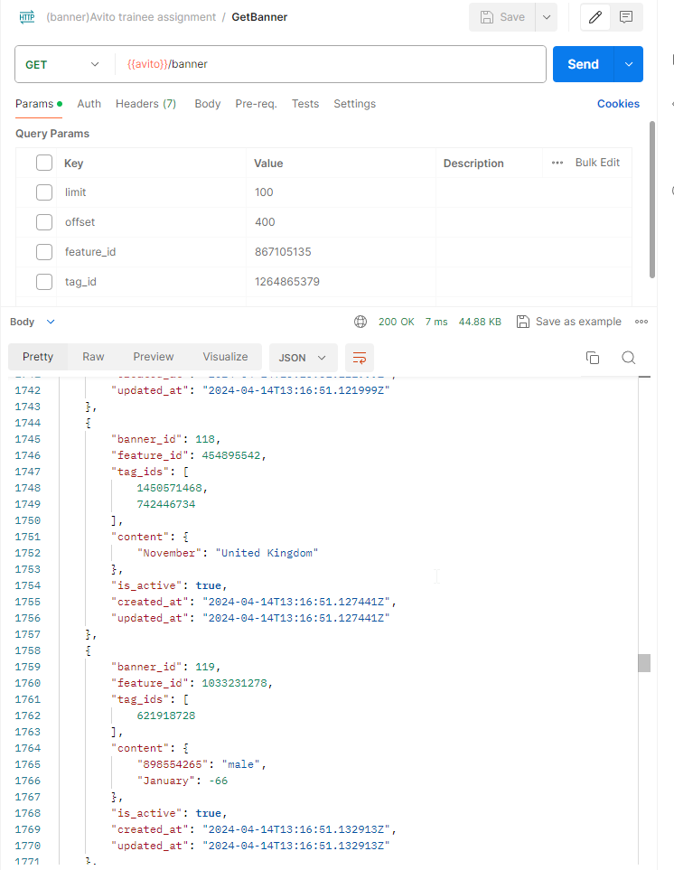

Попробуем получить какой-нибудь из этих баннеров как пользователь<br>
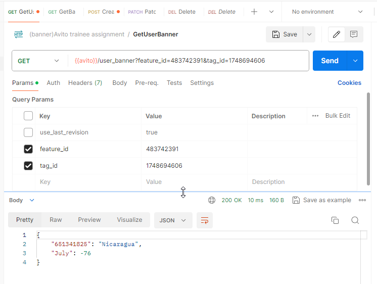

Попробуем создать парочку баннеров с одинаковыми тегами, но разными фичами
<br> <br>

Теперь получим баннеры с фильтрацией по тегу 228 как админ <br>
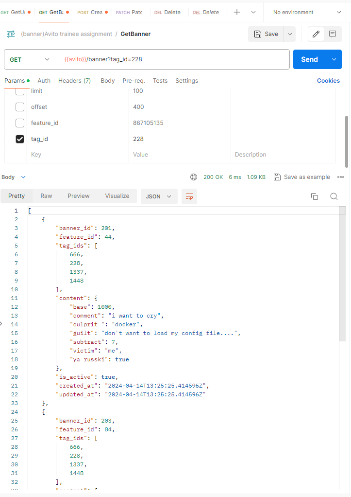

Если попытаться создать баннер, который нарушает уникальность уже созданного ранее баннера,
получим ошибку 400 BadRequest<br>
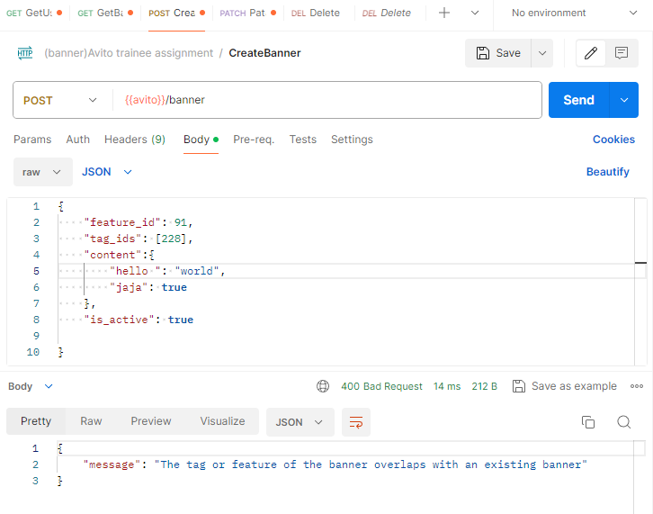

Попробуем наконец получить какой-нибудь ещё баннер как пользователь<br>
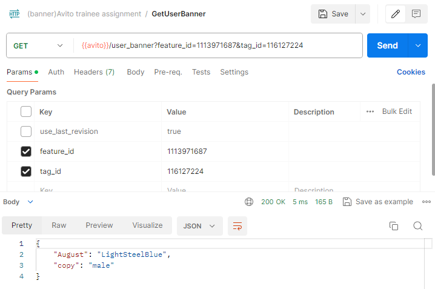

Изменим ему контент<br>
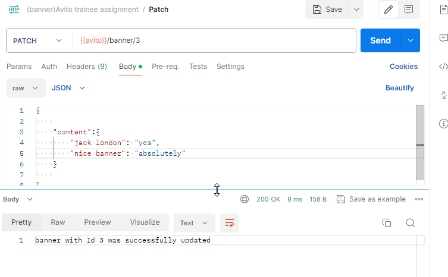

Попробуем снова его получить за пользователя (попытка другая - здесь время ответа другое)<br>
Как видим, пользователь получил устаревшую информацию, потому что не передал use_last_revision<br>

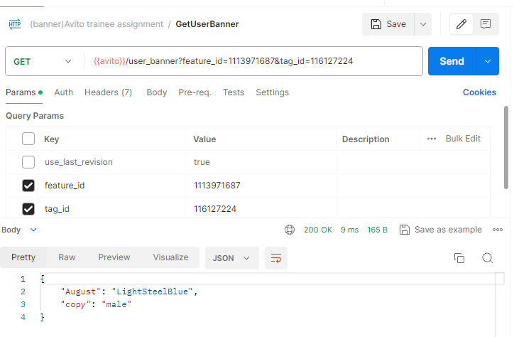

А если он передаст use_last_revision, то получит самый свежий баннер<br>
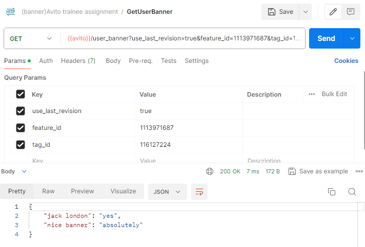

Попробуем удалить все баннеры с тегом 228. Получим в ответ 204 No Content<br>
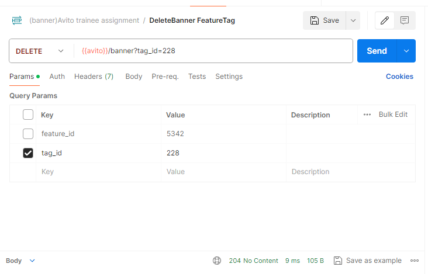

И действительно - по запросу с фильтрацией по такому тегу получаем пустой массив.
<details>
<summary>Почему пустой, а не 404</summary>
Потому что в API, приложенном к заданию, не было ответа 404 для админа, а вот ответ 200 был
</details>
<br>

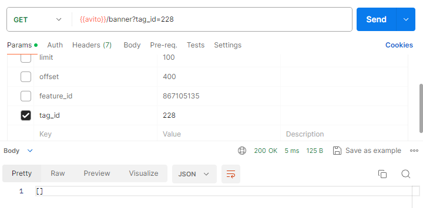

А если удалим баннер, к которому недавно обращался пользователь, он ничего не получит<br>
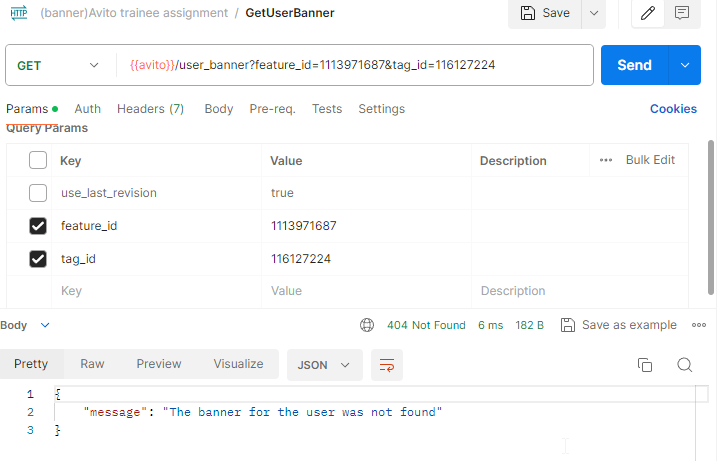

При попытке обращения к неактивному баннеру, сервис пользователю ничего не отдаст.<br>
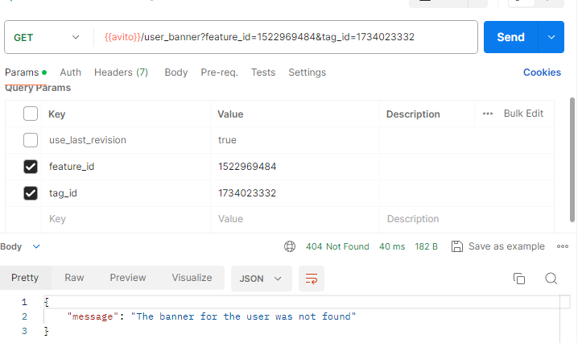

И даже use_last_revision ему не поможет<br>
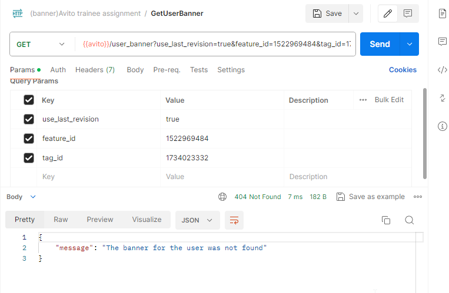

Здесь я прошёлся по базовым сценариям. И так получилось много картинок, не хочу дальше нагромождать.
Напоминаю, что можно самостоятельно
попробовать [в Postman](assets/(banner)Avito%20trainee%20assignment.postman_collection.json)

# Основные условия

- [x] API. Все запросы обрабатываются, все ошибки возвращаются в соответствии с API
- [x] В RPS 1k, SLI времени 50ms, SLI успешности уложился. [Пруфы](#нагрузочное-тестирование-много-картинок-из-jmeter)
- [x] Вот это был [сложный момент](#авторизация). Кратко: я сгенерировал 2 бессрочных токена с клеймом admin.
  В одном он был true, в другом false. К получению по тегу и фиче имеют доступ как админ, так и пользователь.
  Изменять, создавать и просматривать неактивные может только админ.
- [x] [Тесты](#интеграционные-и-e2e-тесты)
- [x] [В примерах в самом низу](#примеры-запросов-и-ответов-много-картинок-из-postman)

Уникальность комбинации feature_id и ANY(tag_ids) обеспечивается дополнительной таблицей в базе,
которая хранит зависимости баннера и тега. feature_id и tag_id являются для неё первичным ключом -
это и обеспечивает уникальность

# Дополнительные задания

## Адаптация для множества тегов и фич

Я проводил тесты с количеством баннеров близком к 3000, а RPS=15к.
Теги и фичи там имели диапазон от 0 до Uint32(4,294,967,295).
Вообще система поддерживает int64, но для тестов было удобнее uint32 генерировать.

Малое время получения популярных баннеров обеспечивается сохранением оных в кеш.

Точно сказать, что система прямо хорошо адаптирована к большому количеству фич и большой нагрузке, я не могу.
Но, насколько могу судить по [тестированию](#нагрузочное-тестирование-много-картинок-из-jmeter), сервер выдерживает
большие нагрузки неплохо.

## Нагрузочное тестирование (много картинок из Jmeter)

Нагрузочное тестирование я проводил в JMeter

Создаю новый генератор вот с такими параметрами:
500 потоков константно и без задержек

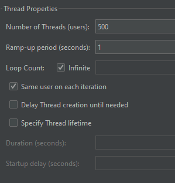

### Первая итерация

Запрос на получение баннера с фичей 9 и тегом 1.
Обращение будет к одному баннеру, соответственно он при первой попытке получения попадёт в кеш
<br><br>

При такой нагрузке отдельный запрос из postman на получение ВСЕХ баннеров занял 55 ms. Их там было около 1500 штук
<br><br>

На создание под нагрузкой ушло 57 мс
<br><br>

На получение баннера, который НЕ в начале базы лежит - 38 ms. Индексы хорошо отрабатывают :)
<br><br>

### Вторая итерация

Ещё запустил в 2 разных запроса. Здесь идёт обращение к 2 конкретным баннерам,
соответственно они уже успели попасть в кеш.
RPS=14к (показатель throughput), среднее время ответа 31мс (показатель average). В SLO уложился вроде:)
<br><br>

### Вариант более экстремальный

Попозже я решил проверить, что будет, если к 500 пользователей, которым нужны баннеры, добавить ещё 100 неугомонных
админов, которые хотят смотреть содержимое всех баннеров несколько раз в секунду. Здесь уже результаты не такие
красивые -
среднее время ответа составило 200мс, но это при RPS=5к.
<br><br>

В постмане та же история
<br><br>

Потом попробовал разное количство потоков и пришёл к RPS=1к, как в задании.<br>
При такой нагрузке время ответа на получение конкретного баннера составляет чуть меньше 50мс, как и требовалось в
условии
<br><br>

за всё время пока тестил на сервер пришло 33гб а отдал он 61гб.
<br><br>
Эмулировать создание и обновление баннеров через Jmeter я не стал, поскольку это довольно трудозатратно в плане
написания генератора, да и я не знаю как, если честно. Решил оставшееся время потратить на более важные вещи)

### Выводы

Вроде сервер неплохо себя показывает:) Также надо ещё по-хорошему эмулировать создание, обновление и удаление баннеров.
Тут ещё стоит сделать ВАЖНОЕ замечание, что запускается это всё дело через докер, но на моей локальной машине, которая
довольно ограничена в русурсах. Ноут у меня не очень мощный - CPU:Ryzen 5 4600 RAM: 16GB (из которых обычно свободно не
больше 10 GB). Скорее всего на настоящем сервере будет работать быстрее. Не проверял :)

## Удаление по фиче или тегу

у меня в базе сейчас примерно 500 баннеров (пока тестил удаление, id дошёл до 3200, так что первая запись имеет id
3211). У них у всех фича стоит 777, чтобы протестить удаление большого количества баннеров
<br><br>

если попытаться удалить все баннеры с фичей 777(почти 500 штук), то время ответа составит <100ms.
<br><br>
Но это без нагрузки

А вот с нагрузкой. 12к RPS (к кешированным баннерам). Время ответа на Delete по фиче = 27ms.
<br><br>

В Delete у меня реализовано выполнение отложенного действия через defer, так что по сути вся работа по удалению
происходит после ответа клиенту. Не знаю, такая ли реализация имелась в виду в дополнительном задании,
но я реализовал так.

## Версионирование

Это я не реализовал. Такой функционал надо было сразу закладывать в архитектуру и API, а я решил оставить на потом.
А потом времени не хватило уже

## Интеграционные и E2E тесты

Я реализовал интеграционные тесты на все основные функции:
GET /user_banner, GET /banner, POST /banner, PATCH /banner/{id}, DELETE /banner/{id}, DELETE /banner (это по фиче или
тегу)
Есть т.н. Happy тесты - когда должен прийти ответ 200, есть проверка разных краевых случаев, например,
если админ попытается создать дубликат баннера

Также один E2E тест на сценарии, когда баннер должен оказаться недоступен после изменения админом.

Собственно, они все лежат в папке tests, запускаются при запуске сервера и проходят проверку.

## Конфигурация линтера

В качестве линтера я использовал golangci-lint, который представляет собой инструмент для запуска разных линтеров. 
Удобно)

[Конфигурация линтера](config/.golangci.yml)

# Вопросы и трудности

## Авторизация
Это был самый неочевидный момент для меня. Откуда брать токены? Какие у него клеймы? 
Кто все эти люди?

В итоге я решил, что сервис мой должен только отдавать баннеры - никакой авторизации. Сейчас популярна
микросервисная архитектура, а значит есть какой-то сторонний сервис авторизации SSO. Мне должны только 
отдавать токены, и по-хорошему надо знать сигнатуру этих токенов, но я её сам придумал.
Моя задача - проверить, есть ли в токене клейм admin, и уже действовать исходя из этого.

Секретный ключ я [захардкодил](internal/lib/validator/token.go), но оставил возможность определить его как 
переменную окружения.

## Неактивный баннер

Почему при попытке получить неактивный баннер я говорю пользователю, что такой баннер не найден, вместо того, чтобы
честно ему говорить, что баннер выключен? 
Потому что неактивного баннера для пользователя, можно сказать не существует.

Мне кажется, если сказать клиенту, что баннер просто неактивен, он может решить подождать, пока он снова станет
активным (допустим есть такой функционал на клиентской стороне). А вдруг мы его удалим?
В условии 6 сказано, что пользователь не должен получать баннер, но это не значит, что он должен о нём знать.
Для него баннера просто не существует, а уж что там с ним - выключен, удален или его в природе не существовало - это не должно
волновать пользователя. 

## Как гарантировать уникальность комбинации фичи и тега
Я сделал отдельную таблицу [banner_definition](internal/storage/postgresql/initialization.go) потому что я не нашел
другого адекватного варианта обеспечить уникальность комбинаций feature_id и tag_id.

Сначала я понадеялся на уникальные индексы для feature_id и tag_ids[] в основной таблице banner, но к сожалению,
это работает только на массив целиком в случае tag_ids, так что все комбинации проверить не получится.

Однако я не стал удалять feature Id и tag_ids из оригинальной таблицы, чтобы при получении баннера 
не делать лишние походы в соседнюю таблицу при помощи JOIN (я где-то читал, что при больших объемах, 
джоин оказывает солидное воздействие на производительность не в лучшую сторону)

## Ньюанс с автоинкрементом

### Проблема

Из-за того что при создании, удалении и патче у меня используются транзакции, то при неудачной траназкции запрос
выполняется, а потом транзакция откатывается. Но Id всё равно инкрементируется,и при следующей уже удачной транзакции, у
меня возникает ситуация, что Id не последовательны. Например, текущий баннер с ID 22, а следующий уже с Id 25, если было 
2 неудачные транзакции

### решение
Насколько я понимаю, это нормальное поведение для СУБД, так что я решил ничего не менять.

1) Была мысль перейти на GUID, но их не очень удобно передавать, да и это не соответсвует API.
2) Ещё был вариант в качестве отправной точки для ID использовать прошлый максимальный, но это дополнительный запрос, а
   это дополнительная нагрузка.
   Я подумал, что в таком контексте прерывающиеся ID не такая большая проблема

## Как баннер сохранять в редис

### вопрос

Возник вопрос, как именно сохранять баннер в кеш.
Здесь есть два варианта как поступать:

1) сохранять только выбранную комбинацию. Например, у нас есть баннер:<br>
   feature: 10; tags: {5, 2, 12}<br>
   а пользователь должен получить баннер по запросу<br>
   feature: 10; tag: 5, <br>
   то в кеш будет сохранена только эта комбинация, а не все возможные комбинации тегов и фичи
2) сохранять все возможные комбинации

- В 1 случае у нас на каждую уникальную комбинацию будет больше походов в БД, а потом сохранение в кеш.
- А во 2 случае даже при одной попытке получения баннера по фиче-тегу будут в кеш сохраняться вообще все возможные
  комбинации тегов и фич. А их вроде как не мало. Звучит не совсем оптимально.
  Но всё же решение тут стоит принимать, исходя из соображений о том, насколько много у нас тегов и как часто происходят
  попытки получения по разным тегам.

### решение

Я всё же предположил, что у нас в системе часто будет происходить вызов по похожим тегам, ну и решил выбрать 1 вариант.
А там уж надо смотреть в реальных условиях и анализировать.

## Немного про int64 или int

Я решил использовать int64 с замахом на большое количество тегов и фич. Я несколько раз менял тип в процессе разработки, 
но остановился на этом.

Возможно имело смысл использовать uint, но эта мысль пришла в середине разработки, так что мне было немного страшно,
что система упадет, так что я решил не переписывать.

## Отсутствие ответа 403 в GET /user_banner
В API для пользователя есть ошибка "пользователь не имеет доступа", но я не знаю, какой пользователь может не иметь доступа. 
Я обработал случай, когда токен не валиден - я говорю пользователю, что он не авторизован 401 Unauthorized. 
Возможно здесь речь о [неактивном баннере](#неактивный-баннер), мол, что пользователь не имеет к нему доступа,
но в моей интерпертации пользователь даже не знает о нём. Подробнее [тут](#неактивный-баннер)

## Конфиг файл в докере....

Это было тяжело... я не мог понять, почему внутри контейнера main не может достучаться до stage.yaml,
который лежит буквально в корневой папке. 
Оказалось, что необходимо завести отдельную volume под конфиг внутри контейнера, чтобы адекватно к нему обращаться в рамках
файловой системы

# Заключение
Вообще в процессе разработки возникало о-о-очень много вопросов и страхов. Те, что я выписал сразу или вспомнил, пока
писал Readme - написаны, но ещё многое осталось неупомянуто)

Ещё раз спасибо за тестовое - это было тяжело, но дико полезно:))